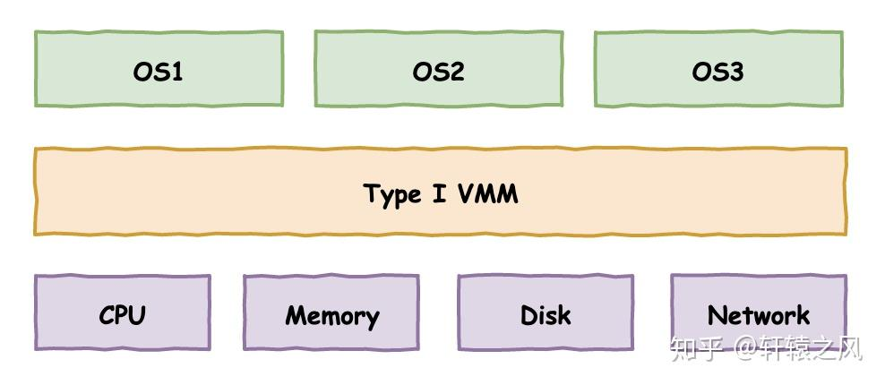
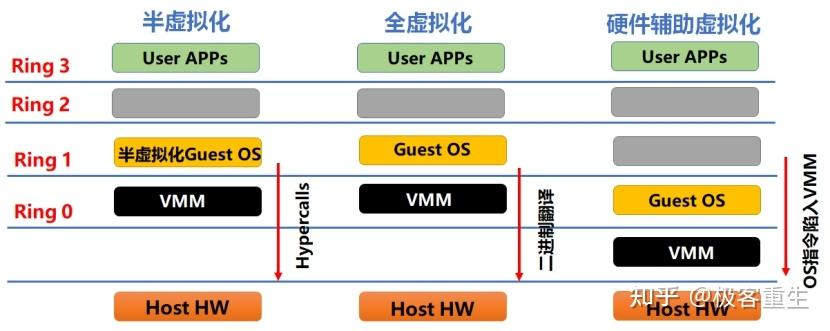
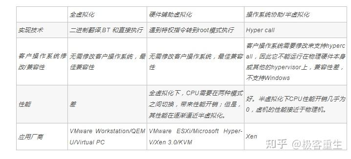
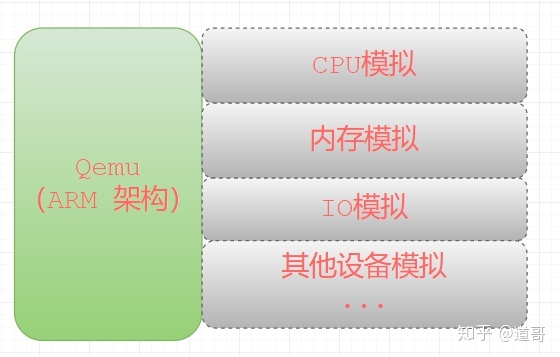
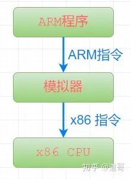

# 虚拟化技术
references:  
[懂了！VMware、KVM、Docker原来是这么回事儿](https://zhuanlan.zhihu.com/p/272202324)  
[深入理解虚拟化](https://zhuanlan.zhihu.com/p/441287815)


虚拟化管理程序Hypervisor（VMM，Virtual Machine Monitor），位于虚拟机与底层硬件设备之间的虚拟层，直接运行于硬件设备之上，负责对硬件资源进行抽象，为上层虚拟机提供运行环境所需资源，并使每个虚拟机都能够互不干扰、相互独立地运行于同一个系统中。




从图中可以清楚的看到两种虚拟化方案的区别：
* Type I: 直接凌驾于硬件之上，构建出多个隔离的操作系统环境
* Type II: 依赖于宿主操作系统，在其上构建出多个隔离的操作系统环境

我们熟知的VMware事实上有两个产品线，一个是VMware ESXi，直接安装在裸金属之上，不需要额外的操作系统，属于第一类虚拟化。另一个是我们普通用户更加熟知的VMware WorkStation，属于第二类虚拟化。






## 全虚拟化：VMware 二进制翻译技术

VMware和QEMU走出了两条不同的路。

VMware创造性的提出了一个二进制翻译技术。VMM在虚拟机操作系统和宿主计算机之间扮演一个桥梁的角色，将虚拟机中的要执行的指令“翻译”成恰当的指令在宿主物理计算机上执行，以此来模拟执行虚拟机中的程序。你可以简单理解成Java虚拟机执行Java字节码的过程，不同的是Java虚拟机执行的是字节码，而VMM模拟执行的就是CPU指令。

另外值得一提的是，为了提高性能，也并非所有的指令都是模拟执行的，VMware在这里做了不少的优化，对一些“安全”的指令，就让它直接执行也未尝不可。所以VMware的二进制翻译技术也融合了部分的直接执行。

对于虚拟机中的操作系统，VMM需要完整模拟底层的硬件设备，包括处理器、内存、时钟、I/O设备、中断等等，换句话说，VMM用纯软件的形式“模拟”出一台计算机供虚拟机中的操作系统使用。

这种完全模拟一台计算机的技术也称为全虚拟化，这样做的好处显而易见，虚拟机中的操作系统感知不到自己是在虚拟机中，代码无需任何改动，直接可以安装。而缺点也是可以想象：完全用软件模拟，转换翻译执行，性能堪忧！

而QEMU则是完全软件层面的“模拟”，乍一看和VMware好像差不多，不过实际本质是完全不同的。VMware是将原始CPU指令序列翻译成经过处理后的CPU指令序列来执行。而QEMU则是完全模拟执行整个CPU指令集，更像是“解释执行”，两者的性能不可同日而语。

## 半虚拟化：Xen 内核定制修改

既然有全虚拟化，那与之相对的也就有半虚拟化，前面说了，由于敏感指令的关系，全虚拟化的VMM需要捕获到这些指令并完整模拟执行这个过程，实现既满足虚拟机操作系统的需要，又不至于影响到物理计算机。

但说来简单，这个模拟过程实际上相当的复杂，涉及到大量底层技术，并且如此模拟费时费力。

而试想一下，如果把操作系统中所有执行敏感指令的地方都改掉，改成一个接口调用（HyperCall），接口的提供方VMM实现对应处理，省去了捕获和模拟硬件流程等一大段工作，性能将获得大幅度提升。

这就是半虚拟化，这项技术的代表就是Xen，一个诞生于2003年的开源项目。

这项技术一个最大的问题是：需要修改操作系统源码，做相应的适配工作。这对于像Linux这样的开源软件还能接受，充其量多了些工作量罢了。但对于Windows这样闭源的商业操作系统，修改它的代码，无异于痴人说梦。

## 硬件辅助虚拟化 VT / AMD-v

折腾来折腾去，全都是因为x86架构的CPU天然不支持经典虚拟化模式，软件厂商不得不想出其他各种办法来在x86上实现虚拟化。

如果进一步讲，CPU本身增加对虚拟化的支持，那又会是一番怎样的情况呢？

在软件厂商使出浑身解数来实现x86平台的虚拟化后的不久，各家处理器厂商也看到了虚拟化技术的广阔市场，纷纷推出了硬件层面上的虚拟化支持，正式助推了虚拟化技术的迅猛发展。

这其中为代表的就是Intel的VT系列技术和AMD的AMD-v系列技术。

原先的VMM为了能够掌控虚拟机中代码的执行，不得已采用“中间人”来进行翻译执行，现在新的CPU告诉VMM：不用那么麻烦了，你提前告诉我你对哪些指令哪些事件感兴趣，我在执行这些指令和发生这些事件的时候就通知你，你就可以实现掌控了。完全由硬件层面提供支持，性能自然高了不少。

VMware从5.5版本开始引入对硬件辅助虚拟化的支持，随后在2011年的8.0版本中正式全面支持。于是乎，我们在创建虚拟机的时候，可以选择要使用哪一种虚拟化引擎技术，是用原先的二进制翻译执行，还是基于硬件辅助虚拟化的新型技术。


## KVM-QEMU

有了硬件辅助虚拟化的加持，虚拟化技术开始呈现井喷之势。VirtualBox、Hyper-V、KVM等技术如雨后春笋般接连面世。这其中在云计算领域声名鹊起的当属开源的KVM技术了。

KVM全称for Kernel-based Virtual Machine，意为基于内核的虚拟机。

在虚拟化底层技术上，KVM和VMware后续版本一样，都是基于硬件辅助虚拟化实现。不同的是VMware作为独立的第三方软件可以安装在Linux、Windows、MacOS等多种不同的操作系统之上，而KVM作为一项虚拟化技术已经集成到Linux内核之中，可以认为Linux内核本身就是一个HyperVisor，这也是KVM名字的含义，因此该技术只能在Linux服务器上使用。


KVM技术常常搭配QEMU一起使用，称为KVM-QEMU架构。前面提到，在x86架构CPU的硬件辅助虚拟化技术诞生之前，QEMU就已经采用全套软件模拟的办法来实现虚拟化，只不过这种方案下的执行性能非常低下。

KVM本身基于硬件辅助虚拟化，仅仅实现CPU和内存的虚拟化，但一台计算机不仅仅有CPU和内存，还需要各种各样的I/O设备，不过KVM不负责这些。这个时候，QEMU就和KVM搭上了线，经过改造后的QEMU，负责外部设备的虚拟，KVM负责底层执行引擎和内存的虚拟，两者彼此互补，成为新一代云计算虚拟化方案的宠儿。

## 容器技术-LXC & Docker

前面谈到的无论是基于翻译和模拟的全虚拟化技术、半虚拟化技术，还是有了CPU硬件加持下的全虚拟化技术，其虚拟化的目标都是一台完整的计算机，拥有底层的物理硬件、操作系统和应用程序执行的完整环境。

为了让虚拟机中的程序实现像在真实物理机器上运行“近似”的效果，背后的HyperVisor做了大量的工作，付出了“沉重”的代价。但是虚拟机中的程序只是想要一个单独的执行执行环境，不需要你费那么大劲去虚拟出一个完整的计算机来。近几年大火的容器技术正是在这样的指导思想下诞生的。


不同于虚拟化技术要完整虚拟化一台计算机，容器技术更像是操作系统层面的虚拟化，它只需要虚拟出一个操作系统环境。

LXC技术就是这种方案的一个典型代表，全称是LinuX Container，通过Linux内核的Cgroups技术和namespace技术的支撑，隔离操作系统文件、网络等资源，在原生操作系统上隔离出一个单独的空间，将应用程序置于其中运行，这个空间的形态上类似于一个容器将应用程序包含在其中，故取名容器技术。

如今各个大厂火爆的Docker技术底层原理与LXC并无本质区别，甚至在早期Docker就是直接基于LXC的高层次封装。Docker在LXC的基础上更进一步，将执行执行环境中的各个组件和依赖打包封装成独立的对象，更便于移植和部署。

容器技术的好处是轻量，所有隔离空间的程序代码指令不需要翻译转换，就可以直接在CPU上执行，大家底层都是同一个操作系统，通过软件层面上的逻辑隔离形成一个个单独的空间。

容器技术的缺点是安全性不如虚拟化技术高，毕竟软件层面的隔离比起硬件层面的隔离要弱得多。隔离环境系统和外面的主机共用的是同一个操作系统内核，一旦利用内核漏洞发起攻击，程序突破容器限制，实现逃逸，危及宿主计算机，安全也就不复存在。

## 超轻虚拟化 firecracker

虚拟完整的计算机隔离性好但太过笨重，简单的容器技术又因为太过轻量纯粹靠软件隔离不够安全，有没有一个折中的方案同时兼具两者的优点，实现既轻量又安全呢？

近年来，一种超轻虚拟化的思想开始流行开来，亚马逊推出的firecracker就是一个典型的代表。

firecracker将虚拟化技术的强隔离性和容器技术的轻量性进行融合，提出了一个microVM的概念，底层通过KVM虚拟化技术实现各个microVM的强隔离，而隔离的虚拟机中运行的是一个个精简版的微型操作系统，砍掉了大量无用的功能，专为容器设计的微型OS。

超轻虚拟化如今成为一个新的浪潮，除了AWS的firecracker，谷歌的gVisor, Intel主导的NEMU也在向这个领域开始发力。

# QEMU

references:  
[Welcome to QEMU’s documentation!](https://qemu-project.gitlab.io/qemu/index.html)  
[Standard options](https://www.qemu.org/docs/master/system/invocation.html)  
[一步步教你：如何用Qemu来模拟ARM系统](https://zhuanlan.zhihu.com/p/340362172)  

## 为什么需要QEMU模拟

ARM平台的软件开发工作，可以划分为2类：
* 应用程序的开发
* 系统开发(内核、文件系统、驱动程序)

以上这两种分类，主要是从开发工作的内容角度来进行划分的。可以看出：
* 应用程序开发：灵活性更大、需求变动会更多(产品经理或项目经理经常给你改需求)。
* 系统软件开发：需求更稳定、很多代码都是官方提供或者开源的，工作内容就是进行定制、裁剪。

系统开发的最终目的是：为应用程序的执行准备一个基本的执行环境，内容包括：系统引导程序bootloader，内核kernel，文件系统rootfs，系统中所有设备的驱动程序。在实际的项目开发中，系统开发难度更大一些，一旦开发完成，对于一块板子来说基本上不会轻易变动，代码的使用生命周期更长。

对于系统软件开发来说，如果每次编译出一个bootloader、或者kernel，都上一个ARM开发板进行验证，的确比较麻烦。如果能有一个ARM模拟系统，直接在x86上进行模拟，工作效率就会提高很多。


因为Qemu是使用纯软件模拟的，它的强项是模拟那些不涉及到外部的具体硬件设备的场景，比如：
* 想学习如何定制bootloader；
* 想在Arm系统中进行文件系统的裁剪，学习文件系统的挂载过程;
* 想体验一下如何配置、裁剪linux kernel； 想学习Linux系统中的设备树；
* ...

以上这些场景中，都非常适合使用Qemu来模拟ARM系统。

## 工作原理

Qemu是一个开源的托管虚拟机，通过纯软件来实现虚拟化模拟器，几乎可以模拟任何硬件设备。比如：Qemu可以模拟出一个ARM系统中的：CPU、内存、IO设备等，然后在这个模拟层之上，可以跑一台ARM虚拟机，这个ARM虚拟机认为自己在和硬件进行打交道，但实际上这些硬件都是Qemu模拟出来的。



正因为Qemu是纯软件实现的，所有的指令都要经过它的转换，所以性能非常低。所以在生产环境中，大多数的做法都是配合KVM来完成虚拟化工作，因为KVM是硬件辅助的虚拟化技术，主要负责比较繁琐的CPU和内存虚拟化，而Qemu则负责I/O虚拟化，两者合作各自发挥自身的优势，相得益彰。这部分不是重点，就不具体深入介绍了。

## Qemu的两种工作模式

Qemu有两种执行模式：

**用户模式(User mode)：**

利用动态代码翻译机制来执行不同主机架构的代码，例如：在x86平台上模拟执行ARM代码，也就是说：我们写一条ARM指令，传入整个模拟器中，模拟器会把整个指令翻译成x86平台的指令，然后在x86的CPU中执行。




**系统模式(System mode)：**

模拟整个电脑系统，利用其它VMM(Xen, KVM)来使用硬件提供的虚拟化支持，创建接近于主机性能的全功能虚拟机。


## 常用指令

references:  
[Ubuntu 上的 QEMU 入门 – 图解指南](https://raspberrytips.com/qemu-on-ubuntu/)  
[Getting started with qemu](https://drewdevault.com/2018/09/10/Getting-started-with-qemu.html)


### 基本步骤

**安装 QEMU 后，以下是使用 QEMU 创建新虚拟机的基本步骤：**
* 下载要使用的操作系统的映像
* 创建一个新的虚拟磁盘，用于安装系统
* 启动 QEMU，指定虚拟磁盘和映像文件

**下载要使用的操作系统的映像**

可以是Linux的发布版本，这里选择 debian 和 alpine

https://cdimage.debian.org/debian-cd/current/arm64/iso-cd/debian-12.1.0-arm64-netinst.iso

https://cdimage.debian.org/debian-cd/current/i386/iso-cd/debian-12.1.0-i386-netinst.iso

https://nl.alpinelinux.org/alpine/v3.8/releases/x86_64/alpine-standard-3.8.0-x86_64.iso

**创建虚拟磁盘**
为 QEMU 创建虚拟磁盘的基本命令是 qemu-img。语法如下：
```
qemu-img create <filename.format> <size>

ex: qemu-img create myvm.qcow2 16G
```

QEMU 支持不同格式的虚拟磁盘：
* qcow2：QEMU 的本机格式。
* vdi：VirtualBox 磁盘。
* vmdk：VmWare 磁盘。
* vhdx：Hyper-v 虚拟磁盘。
* 您可以在[此处](https://qemu-project.gitlab.io/qemu/system/images.html)找到完整列表。

**启动QEMU**
```shell
# ==> ex1:
qemu-img create myvm.qcow2 16G
qemu-system-i386 -boot d -cdrom ./debian-12.1.0-i386-netinst.iso -m 4096 -hda ./myvm.qcow2

# ==> ex2:
curl -O https://nl.alpinelinux.org/alpine/v3.8/releases/x86_64/alpine-standard-3.8.0-x86_64.iso
qemu-img create -f qcow2 alpine.qcow2 16G
qemu-system-x86_64 \
    -enable-kvm \
    -m 4096 \
    -drive file=alpine.qcow2,media=disk,if=virtio \
    -nic user,model=virtio \
    -cdrom alpine-standard-3.8.0-x86_64.iso

# ==> ex3:
# reference: https://futurewei-cloud.github.io/ARM-Datacenter/qemu/how-to-launch-aarch64-vm/
# Create the flash images with the correct sizes.
dd if=/dev/zero of=flash1.img bs=1M count=64
dd if=/dev/zero of=flash0.img bs=1M count=64
dd if=/usr/share/qemu-efi-aarch64/QEMU_EFI.fd of=flash0.img conv=notrunc

# Download the image you want to boot.
# For our example we use an Ubuntu installer.
wget http://ports.ubuntu.com/ubuntu-ports/dists/bionic-updates/main/installer-arm64/current/images/netboot/mini.iso

# Create the empty Ubuntu image file we will install Ubuntu into.
# We will use 20 gigabytes for this file.
qemu-img create ubuntu-image.img 20G

# Start QEMU with the installer.
qemu-system-aarch64 -nographic -machine virt,gic-version=max -m 4096M -cpu max -smp 4 \
-netdev user,id=vnet,hostfwd=:127.0.0.1:0-:22 -device virtio-net-pci,netdev=vnet \
-drive file=ubuntu-image.img,if=none,id=drive0,cache=writeback -device virtio-blk,drive=drive0,bootindex=0 \
-drive file=mini.iso,if=none,id=drive1,cache=writeback -device virtio-blk,drive=drive1,bootindex=1 \
-drive file=flash0.img,format=raw,if=pflash -drive file=flash1.img,format=raw,if=pflash 

# Follow the instructions to install Ubuntu to the ubuntu-image.img file.
# Once the install is finished you can exit QEMU with -a x.
# Then restart QEMU without the installer image with the following command.
qemu-system-aarch64 -nographic -machine virt,gic-version=max -m 4096M -cpu max -smp 4 \
-netdev user,id=vnet,hostfwd=:127.0.0.1:0-:22 -device virtio-net-pci,netdev=vnet \
-drive file=ubuntu-image.img,if=none,id=drive0,cache=writeback -device virtio-blk,drive=drive0,bootindex=0 \
-drive file=flash0.img,format=raw,if=pflash -drive file=flash1.img,format=raw,if=pflash
```
* qemu-system-x86_64：运行具有 64 位架构的经典虚拟机的基本命令
* -boot：指定从哪里启动，a、b（软盘 1 和 2）、c（第一个硬盘）、d（第一个 CD-ROM）、np（从网络适配器 1-4 进行 Etherboot），默认为硬盘启动
* -cdrom：映像文件的位置（可能是 /home/user/Downloads/yourimage.iso）
* -m：该虚拟机所需的 RAM 空间大小
* -hda：刚刚创建的虚拟磁盘的路径（myvm.qcow2）
* -sdl：指定图形配置，使用 SDL 后端，这是最简单的可用图形后端

### 指令梳理

#### 标准选项

**-machine**

`-machine [type=]name[,prop=value[,...]]`

按名称选择模拟计算机。用于列出可用的机器。-machine help

```
qemu-system-arm -M help
equal to:
qemu-system-arm -machine help
```

**--cpu**

`-cpu model`

选择CPU型号（用于列表和附加功能选择）-cpu help

`qemu-system-aarch64 -M virt -cpu help`

**--boot**

`-boot [order=drives][,once=drives][,menu=on|off][,splash=sp_name][,splash-time=sp_time][,reboot-timeout=rb_timeout][,strict=on|off]`

将引导顺序驱动器指定为驱动器字母字符串。有效的驱动器号取决于目标体系结构。

x86 PC 使用：a、b（软盘 1 和 2）、c（第一个硬盘）、d（第一个 CD-ROM）、np（从网络适配器 1-4 进行 Etherboot），默认为硬盘启动。

要仅在第一次启动时应用特定的启动顺序，请通过 once 指定它。请注意，order或once参数不应与bootindex设备属性一起使用，因为固件实现通常不会同时支持两者。

menu=on只要固件/BIOS 支持，就可以启用交互式启动菜单/提示。默认为非交互式启动。

如果固件/BIOS 支持，则当给出选项splash=sp_name 且menu=on 时，可以将启动图片传递到BIOS，使用户能够将其显示为徽标。目前X86系统的Seabios支持它。 限制：启动画面文件可以是jpeg 文件或24 BPP 格式（真彩色）的BMP 文件。分辨率应为SVGA模式支持，因此推荐为320x240、640x480、800x640。

可以将超时传递给 BIOS，当启动失败时，客户机将暂停 rb_timeout 毫秒，然后重新启动。如果 rb_timeout 为“-1”，guest 将不会重新启动，qemu 默认将“-1”传递给 BIOS。目前X86系统的Seabios支持它。

strict=on只要固件/BIOS 支持，就进行严格的启动。这仅在通过 bootindex 选项更改引导优先级时有效。默认为非严格启动。

**-m**

`-m [size=]megs[,slots=n,maxmem=size]`

将来虚拟机 RAM 大小设置为 megs 兆字节。默认值为 128 MiB。可选地，后缀“M”或“G”可用于分别表示以兆字节或千兆字节为单位的值。可选的对插槽，maxmem 可用于设置热插拔内存插槽的数量和最大内存量。请注意，maxmem 必须与页面大小对齐。

例如，以下命令行将客户机启动 RAM 大小设置为 1GB，创建 3 个插槽来热插拔额外内存，并将客户机可以达到的最大内存设置为 4GB：

`qemu-system-x86_64 -m 1G,slots=3,maxmem=4G`

如果未指定 slot 和 maxmem，则不会启用内存热插拔，并且客户机启动 RAM 将永远不会增加。

**-k**

`-k language`

使用键盘布局语言（例如fr法语）。仅当不易获取原始 PC 密钥代码时才需要此选项（例如，在 Mac 上，使用某些 X11 服务器或使用 VNC 或 Curses 显示）。您通常不需要在 PC/Linux 或 PC/Windows 主机上使用它。

可用的布局有：
```
ar  de-ch  es  fo     fr-ca  hu  ja  mk     no  pt-br  sv
da  en-gb  et  fr     fr-ch  is  lt  nl     pl  ru     th
de  en-us  fi  fr-be  hr     it  lv  nl-be  pt  sl     tr
```
默认为en-us.

**-name**

`-name name`

设置来宾的姓名。该名称将显示在 SDL 窗口标题中。该名称也将用于 VNC 服务器。还可以选择设置 Linux 中顶部可见的进程名称。Linux 上还可以启用单个线程的命名以帮助调试。

**-uuid**

`-uuid uuid`

设置系统UUID


#### 块设备选项

**-fd[a/b]**

```
-fda file
-fdb file
```

使用文件作为软盘 0/1 映像（请参阅《系统仿真用户指南》中的“[磁盘映像](https://www.qemu.org/docs/master/system/images.html#disk-images)”一章）。

**-hd[a/b/c/d]**

```
-hda file
-hdb file
-hdc file
-hdd file
```

使用文件作为模拟计算机默认总线上的硬盘 0、1、2 或 3 映像（例如，大多数 x86 计算机上的 IDE 总线，但也可以是其他目标架构上的 SCSI、virtio 或其他总线） 。另请参阅《系统仿真用户指南》中的“[磁盘映像](https://www.qemu.org/docs/master/system/images.html#disk-images)”一章。

**-cdrom**

`-cdrom file`

在模拟机的默认总线上使用文件作为 CD-ROM 映像（这是 x86 上的 IDE1 master，因此您不能 同时使用-hdc和）。-cdrom在支持它的系统上，您可以通过使用 as 文件名来使用主机 CD-ROM /dev/cdrom。

**-drive**

`-drive option[,option[,option[,...]]]`

定义一个新的驱动器。这包括创建块驱动程序节点（后端）以及来宾设备，并且主要是定义 -blockdev 和 -device 操作相应的快捷方式。

-drive接受 接受的所有选项-blockdev。此外，它还知道以下选项：
* `file=file`  
此选项定义与该驱动器一起使用的磁盘映像（请参阅《系统仿真用户指南》中的“磁盘映像”章节）。如果文件名包含逗号，则必须将其加倍（例如，“file=my,,file”以使用文件“my,file”）。  
可以使用特定于协议的 URL 来指定特殊文件（例如 iSCSI 设备）。有关详细信息，请参阅“设备 URL 语法”部分。

* `if=interface`  
此选项定义驱动器连接的接口类型。可用类型有：ide、scsi、sd、mtd、软盘、pflash、virtio、无。  

* `bus=bus,unit=unit`  
这些选项通过定义总线编号和单元 ID 来定义驱动器的连接位置。

* `index=index`  
此选项通过使用给定接口类型的可用连接器列表中的索引来定义驱动器的连接位置。

* `media=media`  
该选项定义媒体的类型：disk 或 cdrom。

* `snapshot=snapshot`  
快照是“打开”或“关闭”，并控制给定驱动器的快照模式（请参阅-snapshot）。

**-mtdblock**

`-mtdblock file`

使用文件作为板载闪存映像。

**-sd**

`-sd file`

使用文件作为 SecureDigital 卡图像。

#### USB 选项

#### 显示选项

#### 仅 i386 目标

#### 网络选项

**-nic**

`-nic [tap|bridge|user|l2tpv3|vde|netmap|vhost-user|socket][,...][,mac=macaddr][,model=mn]`

此选项是一次性配置板载（默认）访客 NIC 硬件和主机网络后端的快捷方式。主机后端选项与以下相应选项相同 -netdev。访客网卡型号可以通过 进行设置 model=modelname。用于model=help列出可用的设备类型。可以使用 来设置硬件 MAC 地址mac=macaddr。

#### 字符设备选项

#### TPM 设备选项

#### 启动映像或特定于内核

使用 QEMU 引导系统的方法大致有 4 种
* 指定一个固件并让它控制寻找内核
* 指定固件并向内核传递提示以启动
* 直接内核映像启动
* 手动将文件加载到来宾地址空间

第三种方法对于快速测试内核很有用，但由于没有固件将配置信息传递给内核，因此硬件必须是可探测的，为精确配置构建的内核或传递一些配置数据（例如 DTB blob）来告诉内核需要什么驱动程序。这些具体细节通常是特定于硬件的。

最后一种方法是将图像加载到来宾地址空间的最通用方法，主要用于考虑处理器重置向量的类型开发。bare metal

对于 x86 机器和其他一些架构，-bios通常会根据给定的任何信息做正确的事情。对于其他机器，更严格的-pflash选项需要针对给定机器类型的闪存设备调整大小的映像。

#### 调试/专家选项

#### 通用对象创建

#### 设备 URL 语法


### 其他


`qemu-system-x86_64 [options] [disk_image]`


为 QEMU 创建虚拟磁盘的基本命令是 qemu-img。语法如下：
`qemu-img create <filename.format> <size>`


qemu-system-aarch64
qemu-system-i386
qemu-system-x86_64-spice
qemu-system-arm
qemu-system-x86_64


## 用户模式

## 系统模式

利用Qemu来运行ARM虚拟机，你有2个选择：

* 简单方式：直接下载别人编译好的映像文件(包含了内核，根文件系统)，直接执行即可。
  缺点是：别人编译好的也许不适合你的需求，没法定制。
* 复杂方式：自己下载内核代码、根文件系统代码(例如：busybox)，然后进行编译。
  优点是：可以按照自己的实际需求，对内核、根文件系统机型裁剪。

在第2种复杂模式中，又可以有2个选择：
* 内核代码、根文件系统代码全部自己手动编译，最后把这些编译结果手动组织在一个文件夹中，形成自己的根目录；
* 利用 buildroot 整个框架，只需要手动进行配置(比如：交叉编译器在本机上的位置、输出路径、系统的裁剪)，然后就可以一键编译出一个完整的系统，可以直接烧写到机器!

### 系统模式-使用映像文件

### 系统模式-全手动构建

### 系统模式-使用 buildroot

#### 编译内核kernel

#### 制作根文件系统

#### 制作镜像文件


https://www.poftut.com/qemu-tutorial/

https://linuxhint.com/qemu-tutorial/

https://www.baeldung.com/linux/qemu-from-terminal
